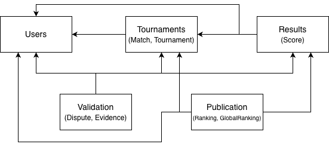
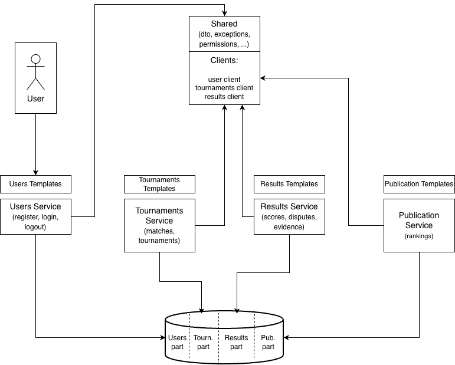

# Tennis result validator

## Team

- Anna Petrova 910345
- Yerulan Zhagyparov 908771
- Sapargali Zhaksylyk 908570

## Introduction

The project's aim is to develop a system for digitalizing and verifying the process of recording, approving and publishing tennis match results.

The system allows the creation of tournaments and matches, registration and assignment of players and referees, submition and validation of scores, observing results and rankings.

This project contains **monolithic (modular)** and **distributed (service-based)** architectures, each in its own directory ("monolith" and "distributed" respectively).

## Requirements and how to run

To run the application Docker is needed.

**Running monolithic version:**

1. ```cd monolith```
2. Build and run the app: ```docker-compose up --build```
3. Go to: ```http://localhost:8000/```

**Running distributed version:**

1. ```cd distributed```
2. Build and run the app: ```docker-compose up --build```
3. Go to: ```http://localhost:8000/```

In the last case docker-compose builds and runs multiple containers, each corresponding to an individual service, using a dedicated Dockerfile per service.

## Technologies

In both architectures: Python 3.14 + Django.

Database: PostgreSQL.

HTML templates were made also using Django framework.

Generative AI (in particular, ChatGPT) was used for the explanations and possible implementations of distributed archtecture. And also for creating Docker files and setting it up.

## Acrhitecture

### Monolithic

We chose to initially develop the system using a modular monolith architecture because of simplicity, development speed and clear domain boundaries. And because it naturally fits with Django framework.

The modular monolith here is a single deployable application which internally is divided into modules, each one for a specific domain (users, tournaments, results, validation and publication).

All modules use one database which runs in a separate container.

Each module has the following structure:

- **web**: contains controllers (for API) and views (collecting and sending data to HTML pages)
- **internal**: private implementations (serializers, models)
- **dto**: DTOs of the models
- **migrations**: migration files to create tables in DB
- **services** (processing data) and **API endpoints** (```api.py```)

Each module also has ```models.py``` file. It's just a "system" file needed for Django in order to work properly.



Arrows mean the usage of this module methods.

Apart from that there is also ```shared``` directory which contains supplementary functions used by each module.

```Resources``` directory contains templates for each module and the ```url.py``` file with all the URLs leading to their views.

### Distributed

Since our app is intended for small tournaments and doesn't expect huge amounts of users, we decided to implement service-based architecture instead of microservices.

We chose a monorepo development process, which then is built in multiple independent services: users, tournaments, results and publication (we unified validation and results into one results service for the simplicity).

All services share the same database but each of them uses only its tables without touching other's services tables.

Each service is a self contained Django application and has modular structure similar to the one described above in the monolithic section. Users and Publication Services have only one module each (users and rankings respectively), Tournaments Service is divided on matches and tournaments modules and Results - on scores, disputes and evidence.

Each service has its own templates which lead to other services' templates by calling their URLs (we decided not to use API gateway).

Example of how this works:

```html
<li class="nav-item">
    <a class="nav-link" href="http://localhost:8001/tournaments/">Tournaments</a>
</li>
```

Here "Tournaments" button leads to the Tournaments Service returning the page with the list of tournaments.

Apart from the services there is also a ```shared``` library which is mounted in every container like that:

```Dockerfile
COPY ../shared /shared
RUN pip install -e /shared
```

This folder contains supplementary files (like in monolithic case), DTOs and services' clients. The last ones are used by other services' in order to call this service's modules. Each client uses module's API which leads to the desired controllers' methods.

Example of the client:

```python
class TournamentsServiceClient:

    BASE_URL = "http://tournaments-service:8001"

    @classmethod
    def get_match(cls, match_id: int):
        response = requests.get(
            f"{cls.BASE_URL}/api/matches/matches/{match_id}"
        )

        response.raise_for_status()
        data = response.json()

        return cls.json_to_match_dto(data)
```

In this example ```get_match``` method calls Tournaments Service in order to get the information about specific match by its id and returns DTO of the found match. After that ```get_match``` method can be used by other services' in order to get the information about some match.

The scheme of the architecture:



When some user opens the application, he initially arrives into Users Service. And then after login he starts to go between other services by clicking buttons and links in templates.
